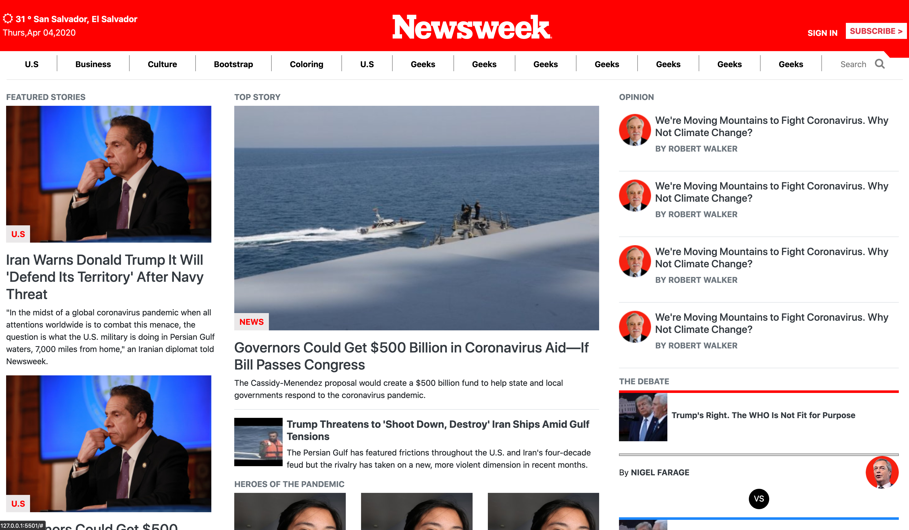
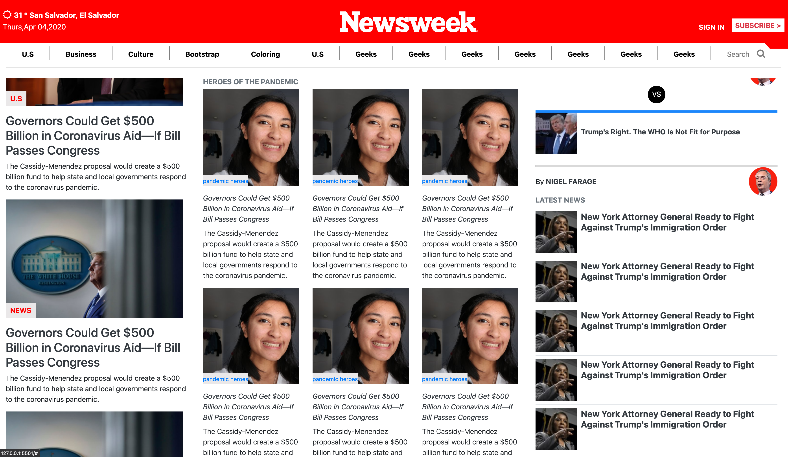

# NewsWeek

> Clone Main Page of NewsWeek

## Built With

- HTML
- CSS
-Bootstrap

## Live Demo

[Live Demo Link](https://rawcdn.githack.com/Ferm0494/NewsWeek/e535de5125ed6a24d67a92bb04ed56cf5898701c/index.html)

## Getting Started
    Feel free to resize the website :)

### Prerequisites

- A web browser that can read HTML and CSS

## Author

👤 **Fernando**

- Github: [@Ferm0494](https://github.com/Ferm0494)
- Twitter: [@ferm494](https://twitter.com/ferm494)
- Linkedin: [@Ferm0494](https://www.linkedin.com/in/ferm0494/)

## 🤝 Contributing

Contributions, issues and feature requests are welcome!

Feel free to check the [issues page](issues/).

## Show your support

Give a ⭐️ if you like this project!

## 📝 License

This project is [MIT](lic.url) licensed.
